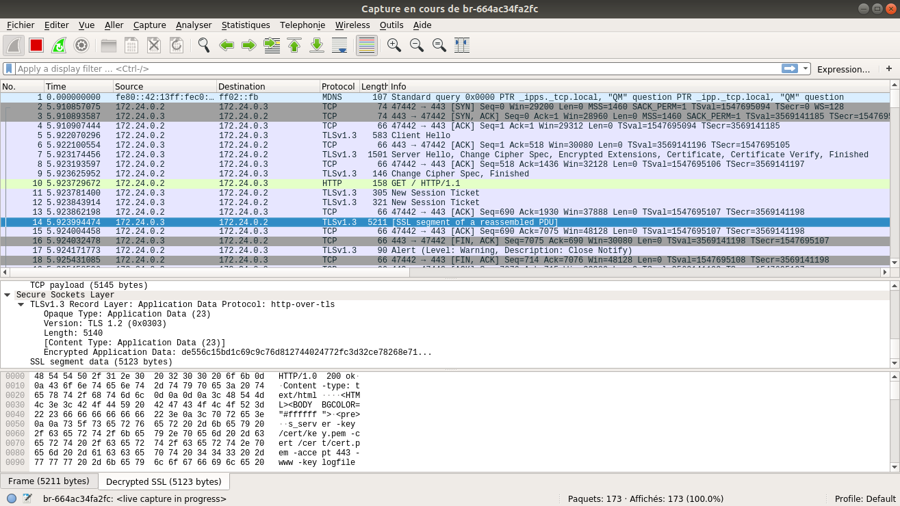

# Projet TLS

## Requirements

- docker-ce
- docker-compose
- python3
- virtualenv
- wireshark >= 3.2.0

## Quelques détails

### Dockerfile

1 Dockerfile par version d'OpenSSL :
- `docker-openssl/1.0.2u/Dockerfile`
- `docker-openssl/1.1.0l/Dockerfile`
- `docker-openssl/1.1.1d/Dockerfile`

### Docker-Compose

- 1 réseau `tls`. L'hôte fournit le bridge, ayant une interface réseau sur ce réseau, elle sera utilisée pour les captures de trames avec Wireshark.
- 1 container `server-102u`, directement lancé comme serveur OpenSSL 1.0.2u.
- 1 container `server-110l`, directement lancé comme serveur OpenSSL 1.1.0l.
- 1 container `server-111d`, directement lancé comme serveur OpenSSL 1.1.1d.
- 1 container `client-102u` qui peut servir de client OpenSSL 1.0.2u ou HTTPS avec cURL.
- 1 container `client-110l` qui peut servir de client OpenSSL 1.1.0l ou HTTPS avec cURL.
- 1 container `client-111d` qui peut servir de client OpenSSL 1.1.1d ou HTTPS avec cURL.
- Certificat et clé privé par défault utilisés par les containers `server-*`, dans `cert/`.
- Output des secrets TLS dans `keylog/key.log`. Notamment utilisé pour déchiffrer les messages HTTPS (ou autre) avec Wireshark.

Tous les containers sont connectés au réseau `tls`.

## Use

```
$ docker-compose build
$ docker-compose up -d
```

## bac à sable

### HTTPS Client vers Server

```
$ docker exec -it client-102u curl -k https://server-102u
$ docker exec -it client-102u openssl s_client -connect server-111d:443
```

Le serveur OpenSSL 1.1.1d est lancé avec le paramètre `-keylogfile`. Dès la première connexion TLS, le fichier `keylog/key.log` (sur l'hôte) peut être exploité par Wireshark pour déchiffrer les messages HTTPS.

- Wireshark (sur l'hôte) :

Lancer Wireshark. Onglet Editer > Préférences > Protocols > SSL > (Pre)-Master-Secret log filename = le fichier `keylog/key.log`. Valider. Sélectionner la bonne interface sur laquelle capturer, exemple : `br-012345abcdef`.

Un exemple de capture avec un message HTTPS déchiffré :



Pour les versions d'OpenSSL 1.0.2u et 1.1.0l, l'extraction des keylogs n'est pas implémentée. Il est possible de les obtenir depuis `client-102u` ou `client-110l` avec les exemples suivants en utilisant cURL :

```
$ SSLKEYLOGFILE=./secrets.keylog curl -k https://server-102u
$ SSLKEYLOGFILE=./secrets.keylog curl -k https://server-111d
```

### Automatisation de l'exécution des sessions TLS

Dans le dossier `scripts/`.

Le script Python `main.py` permet d'établir des sessions TLS vers tous les serveurs OpenSSL depuis chaque client OpenSSL, pour chaque version de TLS et ciphers supportés.

Le script fournit pour chaque session dans le dossier `results` :
- logs de session
- fichier de capture de trames
- fichier de capture de trames déchiffrée si la session a été correctement établie
- secrets TLS si la session a été correctement établie

```
$ cd scripts/
$ virtualenv -p python3 ~/.venv/tsp-tls
$ source ~/.venv/tsp-tls/bin/activate
$ pip install -r requirements.txt
$ chmod +x main.py
# debut : donner les droits de capture avec scapy pour python et tcpdump
$ which python3
~/.venv/tsp-tls/bin/python3
$ sudo setcap cap_net_raw=eip ~/.venv/tsp-tls/bin/python3
$ which tcpdump
/usr/sbin/tcpdump
$ sudo setcap cap_net_raw=eip /usr/sbin/tcpdump
# fin : donner les droits de capture avec scapy pour python et tcpdump
$ ./main.py
```

RAF : le script récupère les données au format brut, il faut désormais les mettre dans une base de données pour la future page Web :)